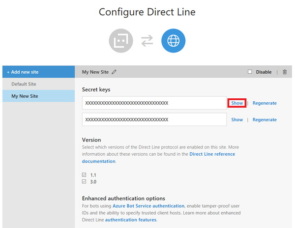

# Connect a bot to Direct Line

This article describes how to connect a bot to the **Direct Line channel**. Use this channel to allow your client application to communicate with a bot.

> NOTE
> The Direct Line is a standard channel over HTTPS protocol to allow communication between a client application and a bot. If you require network isolation instead, use the [Direct Line App Service Extension](bot-service-channel-directline-extension.md) over [WebSocket protocol](https://tools.ietf.org/html/rfc6455).

## Add the Direct Line channel

The first thing you must do is to add the Direct Line channel to the bot.

1. In your browser, navigate to the [Azure Portal](https://portal.azure.com/).
1. In the left panel, click the **Channels** item.
1. In the right panel, under *Add a featured channel*, click the **Direct Line** icon (marked in red in the picture below).

    

1. The **Configure Direct Line** page is displayed. Click the **Done** button at the bottom of the page. This adds the Direct Line channel to the bot, as shown in the picture below.

    

## Add new site

1. In *Connect to channels*, click the **Edit** link by the Direct Line.
1. In *Configure Direct Line*, click **Add new site** and enter a name for your site. This represents the client application that you want to connect to the bot.

    

1. Click **Done**.

## Manage secret keys

When you add the Direct Channel, the Bot Framework generates secret keys. Your client application uses these keys to authenticate the Direct Line API requests that it issues to communicate with a bot. For more information, see [Authentication](~/rest-api/bot-framework-rest-direct-line-3-0-authentication.md).

1. In *Configure Direct Line*, to view a key in plain text, click **Show** for the corresponding key.

    

1. Copy and securely store the key. Use the key to [authenticate](~/rest-api/bot-framework-rest-direct-line-3-0-authentication.md) the Direct Line API requests that your client application issues to communicate with a bot.

    

    > [!NOTE]
    > Secrets should not be exposed or embedded in client applications. See next step.

1. The best practice is to use the Direct Line API to [exchange the key for a token](~/rest-api/bot-framework-rest-direct-line-3-0-authentication.md#generate-token). The client application then will use the token to authenticate its requests within the scope of a single conversation.

## Configure settings

1. Select the Direct Line protocol version that your client application will use to communicate with a bot.

    > [!TIP]
    > If you are creating a new connection between your client application and bot, use Direct Line API 3.0.

1. When finished, click **Done** to save the site configuration. You can repeat this process, beginning with [Add new site](#add-new-site), for each client application that you want to connect to your bot.

When you have the **enhanced authentication enabled**, you will see the following behavior for which trusted origins are used:

- If you configure trusted origins as part of the configuration UI page, then these will **always** be used as the only set. Sending no or additional trusted origins when generating a token or starting a conversation will be ignored (i.e. they are **not appended** to the list or cross validated).
- If you have not configured trusted origins as part of the configuration UI, then any value you send as part of the API calls will be used.

## Example

You can download a .NET example from this location: [Direct Line Bot Sample](https://github.com/microsoft/BotFramework-DirectLine-DotNet/tree/master/samples/core-DirectLine).

The example contains two projects:

- [DirectLineBot](https://github.com/microsoft/BotFramework-DirectLine-DotNet/tree/master/samples/core-DirectLine/DirectLineBot). It creates a bot to connect via a Direct Line channel.
- [DirectLineClient](https://github.com/microsoft/BotFramework-DirectLine-DotNet/tree/master/samples/core-DirectLine/DirectLineClient). This is a console application that talks to the previous bot via Direct Line channel.

### Direct Line API

- Credentials for the Direct Line API must be obtained from the Bot Channels Registration or the Web App Bot in the Azure portal, and will only allow the caller to connect to the bot for which they were generated. In the bot project, update the `appsettings.json` file with these values.

    ```csharp
    {
    "MicrosoftAppId": "",
    "MicrosoftAppPassword": ""
    }
    ```

- In the Azure portal, enable Direct Line in the channels list and then, configure the Direct Line secret. Make sure that the checkbox for version 3.0 is checked. In the console client project update the `App.config` file with the Direct Line secret key and the bot handle (Bot Id).

    ```xml
    <appSettings>
        <add key="DirectLineSecret" value="YourBotDirectLineSecret" />
        <add key="BotId" value="YourBotHandle" />
    </appSettings>
    ```

User messages are sent to the Bot using the Direct Line Client `Conversations.PostActivityAsync` method using the `ConversationId` generated previously.

```csharp
while (true)
{
    string input = Console.ReadLine().Trim();

    if (input.ToLower() == "exit")
    {
        break;
    }
    else
    {
        if (input.Length > 0)
        {
            Activity userMessage = new Activity
            {
                From = new ChannelAccount(fromUser),
                Text = input,
                Type = ActivityTypes.Message
            };

            await client.Conversations.PostActivityAsync(conversation.ConversationId, userMessage);
        }
    }
}
```