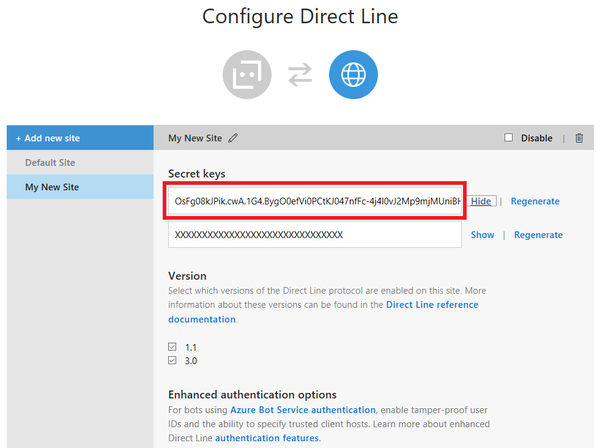

# Connect a bot to Direct Line

This article describes the **Direct Line channel**. You use this channel to allow your own client application to communicate with a bot.

## Add the Direct Line channel

The first thing you must do is to add the Direct Line channel to the bot.

1. In your browser, navigate to the [Azure Portal](https://portal.azure.com/).
1. In the left panel, click the **Channels** item.
1. In the right panel, under *Add a featured channel*, click the **Direct Line** icon (marked in red in the picture below).

    

1. The **Configure Direct Line** page is displayed. Click the **Done** button at the bottom of the page. This adds the Direct Line channel to the bot, as shown in the picture below.

    

## Add new site

1. In *Connect to channels*, click the **Edit** link by the Direct Line.
1. In *Configure Direct Line*, click **Add new site** and enter a name for your site. This represents the client application that you want to connect to the bot.

    

1. Click **Done**.

## Manage secret keys

When you add the Direct Channel, the Bot Framework generates secret keys. Your client application uses these keys to authenticate the Direct Line API requests that it issues to communicate with a bot. For more information, see [Authentication](~/rest-api/bot-framework-rest-direct-line-3-0-authentication.md).

1. In *Configure Direct Line*, to view a key in plain text, click **Show** for the corresponding key.

    

1. Copy and securely store the key. Use the key to [authenticate](~/rest-api/bot-framework-rest-direct-line-3-0-authentication.md) the Direct Line API requests that your client application issues to communicate with a bot.

    

1. Alternatively, use the Direct Line API to [exchange the key for a token](~/rest-api/bot-framework-rest-direct-line-3-0-authentication.md#generate-token) that your client can use to authenticate its subsequent requests within the scope of a single conversation.

## Configure settings

1. Select the Direct Line protocol version that your client application will use to communicate with a bot.

    > [!TIP]
    > If you are creating a new connection between your client application and bot, use Direct Line API 3.0.

1. When finished, click **Done** to save the site configuration. You can repeat this process, beginning with [Add new site](#add-new-site), for each client application that you want to connect to your bot.

When you have the **enhanced authentication enabled**, you will see the following behavior for which trusted origins are used:

- If you configure trusted origins as part of the configuration UI page, then these will **always** be used as the only set. Sending no or additional trusted origins when generating a token or starting a conversation will be ignored (i.e. they are **not appended** to the list or cross validated).
- If you have not configured trusted origins as part of the configuration UI, then any value you send as part of the API calls will be used.