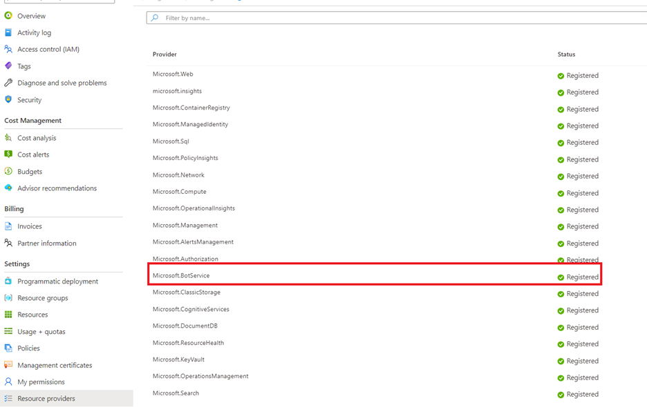
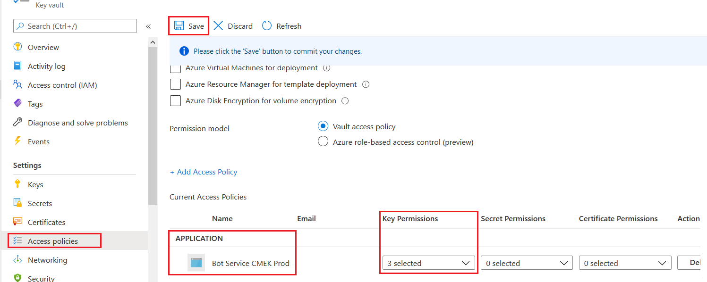

# Azure Bot Service encryption for data at rest

[!INCLUDE [applies-to-v4](includes/applies-to-v4-current.md)]

The Azure Bot Service automatically encrypts your data when it is persisted to the cloud to protect your data and meet organizational security and compliance commitments.

Encryption and decryption are transparent, meaning encryption and access are managed for you. Your data is secure by default and you do not need to modify your code or applications to take advantage of encryption.

## About encryption key management

By default, your subscription uses Microsoft-managed encryption keys. We provide the option as well for you to manage your bot resource with your own Keys called customer-managed keys (CMK). CMK offers greater flexibility to create, rotate, disable, and revoke access controls to the data Bot Service stores. You can also audit the encryption keys used to protect your data.

When encrypting data, Azure Bot Service encrypts with two levels of encryption. In the case where CMK is not enabled, both keys used are Microsoft-managed keys. When CMK is configured, the data is encrypted with both the CMK and a Microsoft-managed key.  

## Customer-managed keys with Azure Key Vault

To utilize the customer-managed keys feature, you must store and manage them in Azure Key Vault. You can either create your own keys and store them in a key vault or use the Azure Key Vault APIs to generate keys. Your bot registration and the key vault must be in the same Azure Active Directory (Azure AD) tenant, but they can be in different subscriptions. For more information about Azure Key Vault, see [What is Azure Key Vault?](/azure/key-vault/key-vault-overview).

When using a customer-managed key, Azure Bot Service encrypts your data in our storage, such that if access to that key is revoked or the key is deleted, your bot will stop being able to use the Bot Service to send or receive messages, and you will not be able to access or edit the configuration of your Bot registration in the Azure Bot Service portal.

> [!IMPORTANT]
> The Azure Bot Service team cannot recover a customer-managed encryption key bot without access to the key.

### Configure your Azure Key Vault instance

Using customer-managed keys with Azure Bot Service requires you to enable two properties on the Azure Key Vault instance that you plan to use to host your encryption keys: **Soft delete** and **Purge protection**. These features work in partnership to ensure that if for some reason your key is accidentally deleted, you can recover it. For more information about soft delete and purge protection, see the [Azure Key Vault soft-delete overview](/azure/key-vault/general/soft-delete-overview).

> [!div class="mx-imgBorder"]
> 

If you are using an existing Azure Key Vault instance, you can verify that these properties are enabled by looking at the **Properties** section on the Azure portal. If any of these properties are not enabled, see the **Key Vault** section in [How to enable soft delete and purge protection](/azure/key-vault/general/key-vault-recovery).

#### To grant the Bot Service access to a key vault

For Azure Bot Service to have access to the key vault you created for this purpose, an access policy needs to be set which gives the Azure Bot Service's service principal the current set of permissions. For more information about Key Vault, including how to create a key vault, see [About Azure Key Vault](/azure/key-vault/general/overview).

1. Register the Azure Bot Service resource provider on your subscription, containing the key vault.
    1. Go to the [Azure portal](https://ms.portal.azure.com).
    1. Open the **Subscriptions** blade and select the subscription that contains the key vault.
    1. Open the **Resource providers** blade and register the **Microsoft.BotService** resource provider.

    > [!div class="mx-imgBorder"]
    > 

1. Configure an access policy on your key vault, giving the **Bot Service CMEK Prod** service principal the **Get** from **Key Management Operations** and **Unwrap Key** and **Wrap Key** from **Cryptographic Operations** key permissions.
    1. Open the **Key vaults** blade and select your key vault.
    1. Make sure that the **Bot Service CMEK Prod** application is added as an access policy and has these 3 permissions. You may need to add the **Bot Service CMEK Prod** application as an access policy to your key vault.
    1. Click **Save** to save any changes you made.

    > [!div class="mx-imgBorder"]
    > 
