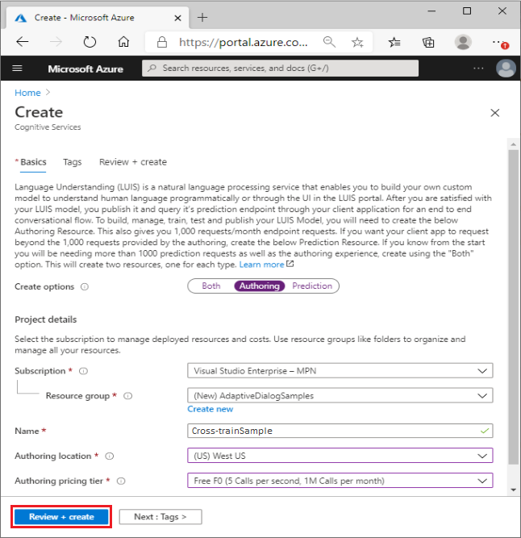
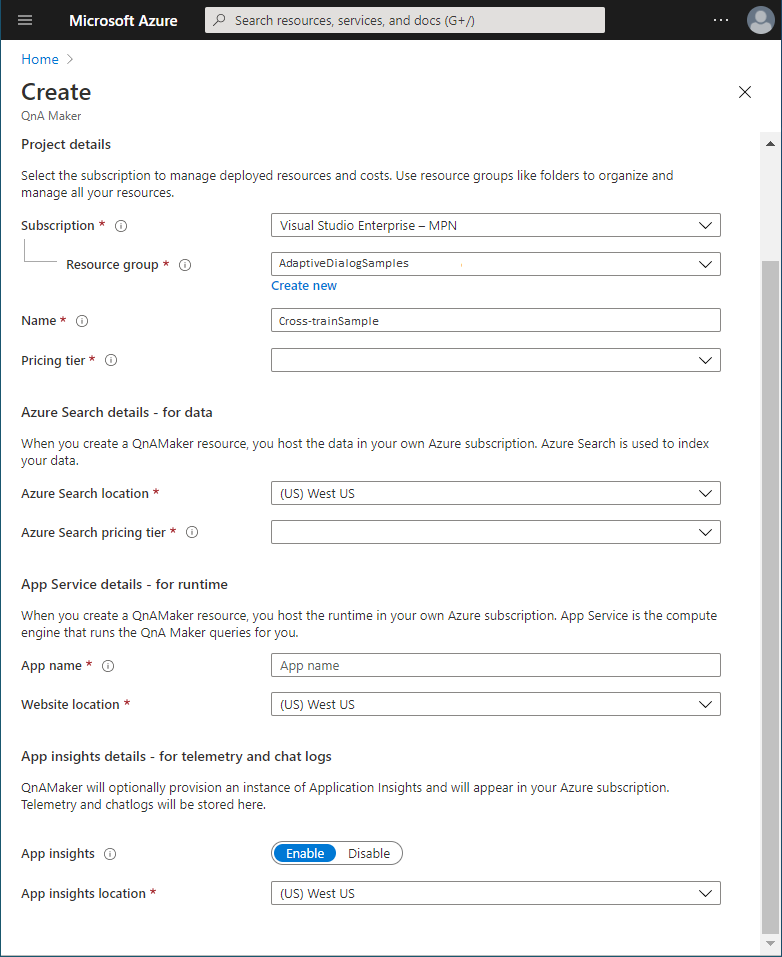
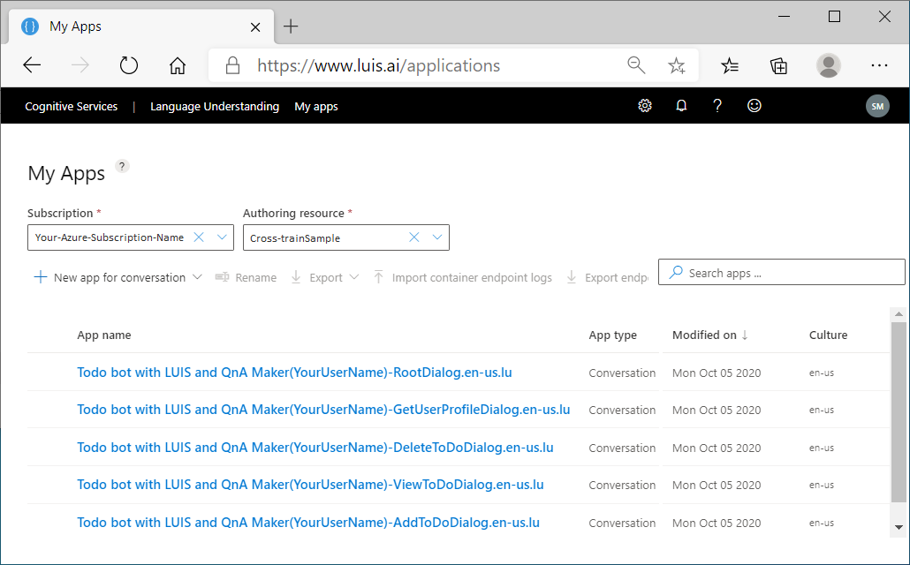
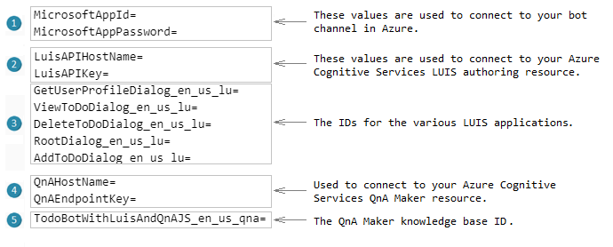

# Create a bot cross trained to use both LUIS and QnA Maker recognizers

[!INCLUDE [applies-to-v4](../includes/applies-to.md)]

This how to article will walk you through the steps required to create a bot that integrates the capabilities of both [LUIS][luis] and [QnA Maker][qnamaker] together in order to determine the best possible response to the user, using [language generation][language-generation], and tying all these features together into a ToDo bot.

Integrating the capabilities of both [LUIS][luis] and [QnA Maker][qnamaker] together requires the use of the [CreateCrossTrainedRecognizer][createcrosstrainedrecognizer].

## Prerequisites

This article will walk you through the steps required to create a fully functional bot using adaptive dialogs, demonstrated using the [The Todo bot with LUIS and QnA Maker sample](#the-todo-bot-with-luis-and-qna-maker-sample). In order to accomplish this, you will need to understand the various concepts involved. Before you begin, you should have a solid basic understanding of the following concepts:

- [Introduction to adaptive dialogs](bot-builder-adaptive-dialog-introduction.md)
- [Events and triggers in adaptive dialogs](bot-builder-concept-adaptive-dialog-triggers.md)
- [Actions in adaptive dialogs](bot-builder-concept-adaptive-dialog-actions.md)
- [Asking for user input in adaptive dialogs](bot-builder-concept-adaptive-dialog-inputs.md)
- [Recognizers in adaptive dialogs](bot-builder-concept-adaptive-dialog-recognizers.md)
- [Language Generation in adaptive dialogs](bot-builder-concept-adaptive-dialog-generators.md)
- [Memory scopes and Managing state in adaptive dialogs](bot-builder-concept-adaptive-dialog-memory-states.md)
- [Handling interruptions in adaptive dialogs](bot-builder-concept-adaptive-dialog-interruptions.md)
- [.lu file format][lu-templates]
- [.qna file format][qna-file-format]

You will also need an [Azure account][create-azure-account].

## What is covered

This article describes how to create a bot that is cross trained to use both LUIS and QnA Maker recognizers to respond to a user. This will entail the following steps:

1. Introduction to [The Todo bot with LUIS and QnA Maker sample](#the-todo-bot-with-luis-and-qna-maker-sample)
1. [Create your LUIS authoring resource in Azure Cognitive Services](#create-your-luis-authoring-resource-in-azure)
1. [Create your QnA Maker resource in Azure Cognitive Services](#create-your-qna-maker-resource-in-azure-cognitive-services)
1. [Install the Bot Framework SDK CLI](#install-the-bot-framework-cli)
1. [Generate cross-trained LU models](#generate-cross-trained-lu-models)
1. [Create and publish LUIS applications using the build command](#create-and-publish-luis-applications-using-the-build-command)
1. [Create and publish QnA Maker knowledge bases using the build command](#create-and-publish-qna-maker-knowledge-bases-using-the-build-command)
1. [Update your project's configuration file to include connection information for LUIS and QnA Maker](#update-your-projects-configuration-file-to-include-connection-information-for-luis-and-qna-maker)
1. [Testing the bot using Bot Framework Emulator](#testing-the-bot-using-bot-framework-emulator)

## The Todo bot with LUIS and QnA Maker sample

The adaptive **Todo bot with LUIS and QnA Maker** ([**C#**][cs-sample]) sample has five `.lu` files, six `.qna` files and six `.lg` files. When creating the cross-trained language understanding models you will combine the `.lu` and `.qna` files in a way that will enable you to utilize the capabilities of both LUIS and QnA Maker together in the same recognizer, enabling you to train the recognizer how best to interpret and respond to a users request. After running the cross-train command you will have the same number of each file, but they will be updated so that the `.lu` file contains the required `.qna` information and the `.qna` files contains the required `.lu` information to enable the [Cross-trained recognizer set][crosstrainedrecognizerset] to work.

To clone the samples repository, enter the following git command from a console window: `git clone https://github.com/Microsoft/botbuilder-samples.git`

## Create your LUIS authoring resource in Azure

If you don't already have a LUIS authoring resource you want to use for this, you can follow the steps below to create one. For an in-depth explanation of this process, see the article [Deploy LUIS resources using the Bot Framework LUIS CLI commands][create-your-luis-authoring-resource-in-azure].

1. Go to the Azure [Create LUIS Cognitive Services][create-cognitive-services-luis] page.  
2. In the **Create options** section, select **Authoring** to create a LUIS authoring resource.

   

3. Enter values for each of the fields, then select the **Review + create** button.

   

4. Review the values to ensure they are correct, then select the **Create** button.

The LUIS authoring resource will contain the information needed when running the [build command](#create-and-publish-luis-applications-using-the-build-command) or updating your bots [configuration file](#update-your-projects-configuration-file-to-include-connection-information-for-luis-and-qna-maker). Once the resource is created, you can find the following information in the **Keys and Endpoint** blade in your LUIS authoring resource:

- **Keys**. Either of the two key values are used as the _subscriptionKey_ option in the [build command](#create-and-publish-luis-applications-using-the-build-command), as well as the _LuisAPIKey_ in your [configuration file](#update-your-projects-configuration-file-to-include-connection-information-for-luis-and-qna-maker).
- **Endpoint**. This is the value that is used as the _endpoint_ option in the [build command](#create-and-publish-luis-applications-using-the-build-command), as well as the _LuisAPIHostName_ in your [configuration file](#update-your-projects-configuration-file-to-include-connection-information-for-luis-and-qna-maker).
- **Location**.   This is the value that is used as the _region_ option in the [build command](#create-and-publish-luis-applications-using-the-build-command).

   

## Create your QnA Maker resource in Azure Cognitive Services

If you don't already have a QnA Maker resource, you can follow the steps below to create one. For an in-depth explanation of this process, see the article [Deploy QnA Maker knowledge base using the Bot Framework qnamaker CLI commands][create-your-qna-maker-resource-in-azure-cognitive-services].

1. Go to the Azure [Create Qna Maker Cognitive Services][create-cognitive-services-qnamaker] page.
2. Enter values for each of the fields, then select the **Review + create** button.

   

3. Review the values to ensure they are correct, then select the **Create** button.

The QnA Maker resource will contain the value needed for the _subscriptionKey_ option used when running the [build command](#create-and-publish-qna-maker-knowledge-bases-using-the-build-command):

   

## Install the Bot Framework CLI

[!INCLUDE [applies-to-v4](../includes/install-bf-cli.md)]

## Generate cross-trained LU models

<!-- ### Create your cross-trained LUIS models -->

Before running the build command to create your LUIS application in Azure cognitive services, you need to modify your `.lu` files to include the information required to enable it to defer user input to QnA Maker which it does by creating a new `DeferToRecognizer` intent which is created using the following format: `DeferToRecognizer_<recognizer-type>_<dialog-name>`. For example, in **RootDialog.lu** the new intent would be `DeferToRecognizer_QnA_RootDialog`, and it will contain the questions from **RootDialog.qna** as its user utterances. When a user asks any of these questions the bot will direct it to the [QnA Maker Recognizer][qna-maker-recognizer] for processing. Note also that **RootDialog.qna** references **ChitChat.qna**, and the contents of that referenced file will also be included in the new cross-trained **RootDialog.lu** file.

To create the cross-trained files, both `.lu`  and `.qna`, you can use either the BF CLI `luis:cross-train` or `qnamaker:cross-train` command. The following demonstrates using the `luis:cross-train` command:

``` cli
bf luis:cross-train -i <input-folder-name> -o <output-file-name> --config <cross-train-configuration-file>
```

#### The luis:cross-train parameters

- `in`: The directory, including sub-directories, that will be searched for both `.lu` and `.qna` files.
- `out`: The directory to save the new cross-trained `.lu` output files to. This is where the `luis:build` option will point to in its `--in` option.
- `config`: A cross-train configuration file is a JSON file that is necessary for the command to work. Here is an example cross-train configuration file for the **Todo bot with LUIS and QnA Maker** sample:

    ```json
    {
        // list each .lu file including variations per lang x locale.
        // Lang x locale is denoted using 4 letter code. e.g. it-it, fr-fr
        // Paths can either be absolute (full) paths or paths relative to this config file.
        "./RootDialog/RootDialog.lu": {
            // indicate if this is an .lu file for a root dialog.
            "rootDialog": true,
            // list of triggers within that dialog
            "triggers": {
                // Key is name of intent within the .lu file (in this case RootDialog.lu)
                // Value is the path to the child dialog's .lu file.
                "AddItem": "./AddToDoDialog/AddToDoDialog.lu",
                "DeleteItem": "./DeleteToDoDialog/DeleteToDoDialog.lu",
                "ViewItem": "./ViewToDoDialog/ViewToDoDialog.lu",
                "GetUserProfile": "./GetUserProfileDialog/GetUserProfileDialog.lu"
            }
        }
    }
    ```

#### Cross-train the _Todo bot with LUIS and QnA Maker_ sample

To cross-train the **Todo bot with LUIS and QnA Maker** sample:

1. From a terminal, navigate to `samples\csharp_dotnetcore\adaptive-dialog\08.todo-bot-luis-qnamaker`

1. Create a new directory named _generated_

   ```cmd
      md generated
   ```

1. Run the `luis:cross-train` command.

   ```cmd
      bf luis:cross-train -i dialogs -o generated --config dialogs\DialogLuHierarchy.config.json
   ```

Once finished you will have cross-trained versions of the five `.lu` files and six `.qna` files. When running the build commands in the following sections, point to the generated directory for the input files.

> [!IMPORTANT]
>
> You need to run either the `luis:cross-train` command or the `qnamaker:cross-train` command, you do not need to run both. by running `luis:cross-train`, all of the required cross-train information will be included in the resulting `.lu` and `.qna` files. Running both will work, but is unnecessary.

## Create and publish LUIS applications using the build command

For each `.lu` file, including `.lu` files for each locale, the build command combines all the following actions into a single command:

1. Creates one LUIS model for every locale found using your existing `.lu` files.
1. Using that model, it creates a new LUIS app in the specified Azure Cognitive Services resource if none exists, otherwise it will update the existing LUIS app.
1. When updating an existing LUIS app, it will automatically increment the versionId and optionally delete the old version.
1. Trains the new or updated LUIS app, then publishes it.

For a detailed explanation on how to use the `luis:build` command, see [Deploy LUIS applications using the Bot Framework luis CLI commands][luis-build].

## How to use the luis:build command

The LUIS build command with its required parameters:

``` cli
bf luis:build --in <input-file-or-folder> --out <output-file-or-folder> --authoringKey <subscription-key> --region <authoring-region>
```

The `luis:build` command will create all assets you need from your local `.lu` files.

### Required luis:build parameters

- `in`: The directory that will be searched for `.lu` files.
- `out`: The directory to save output files to.
- `botName`: The name of your bot. This will be used as the prefix for the name of the LUIS applications generated.
- `authoringKey`: This is the subscriptionKey.
- `region`: This defines the region to publish your LUIS applications.

For information on the additional options, see [bf luis:build][bf-luisbuild] in the BF CLI readme.

Alternatively, you can include these required, as well as any of the other parameters in a configuration file and refer to them using the `--luConfig` option.

### LUIS build configuration file

The following is a sample of the **luconfig.json** file that you can reference using the `--luConfig` option.

```json
{
    "in": "generated",
    "out": "output",
    "botName":"<your-bot-name>",
    "authoringKey":"<your-32-digit-subscription-key>",
	 "endpoint":"<your-endpoint>",
    "region": "<your-region-default-is-westus>"
}
```

Once this configuration file is created, all you need to do is reference it in your `luis:build` command. For example:

``` cli
bf luis:build --luConfig luconfig.json
```

For a detailed explanation on how to use the `luis:build` command, see [Deploy LUIS applications using the Bot Framework luis CLI commands][luis-build].

#### Create the LUIS applications for the _Todo bot with LUIS and QnA Maker_ sample

To create the LUIS applications for the **Todo bot with LUIS and QnA Maker** sample:

1. From a terminal, navigate to `samples\csharp_dotnetcore\adaptive-dialog\08.todo-bot-luis-qnamaker`

1. Create a new directory named _output_

   ```cmd
      md output
   ```

1. Create your **luconfig.json** file, as shown in the previous section and save it to the root directory of the sample: `samples\csharp_dotnetcore\adaptive-dialog\08.todo-bot-luis-qnamaker`. Make sure and update the entries for the "botName", "authoringKey" and "region" options:

    ```json
    {
        "in": "generated",
        "out": "output",
        "botName":"Todo bot with LUIS and QnA Maker",
        "authoringKey":"<your-32-digit-subscription-key>",
    	  "endpoint":"<your-endpoint>",
        "region": "<your-region-default-is-westus>"
    }
    ```

1. Run the `luis:build` command, using the luConfig file.

   ```cmd
      bf luis:build --luConfig luconfig.json
   ```

Once finished you will have a LUIS application for each of the five `.lu` files in [LUIS](https://www.luis.ai/applications):



> [!TIP]
>
> The `luis:build` command will save a file named **luis.settings.YourUserName.westus.json** to the output directory. This file contains the LUIS application IDs that you will need to add to your configuration file, described in a [later section](#update-your-projects-configuration-file-to-include-connection-information-for-luis-and-qna-maker).

## Create and publish QnA Maker knowledge bases using the build command

The qnamaker build command combines all the following actions into a single command:

1. Creates one QnA Maker model for every locale found using your existing `.qna` files.
1. Creates a new QnA Maker KB if none exists, otherwise it will overwrite the existing KB.
1. It trains your QnA Maker KB then publishes it to the production endpoint.

For a detailed explanation on how to use the `qnamaker:build` command, see [Deploy QnA Maker knowledge base using the Bot Framework qnamaker CLI commands][qna-build].

### How to use the qnamaker:build command

The QnAMaker build command with its required parameters:

``` cli
bf qnamaker:build --in <input-file-or-folder> --out <folder-to-save-files-to> --subscriptionKey <Subscription-Key> --botName <bot-name> --log
```

> [!IMPORTANT]
>
> This command will overwrite your previous QnA Maker model as well any content you might have in your QnA Maker KB, including any content created directly in [QnA Maker.ai](https://www.qnamaker.ai/).

#### The qnamaker:build parameters

- `in`: The directory, including sub-directories, that will be searched for .qna files.
- `out`: The directory to save output files to.
- `log`: A Boolean value that determines if a log is created during this process.
- `botName`: The name of your bot. This will be used to generate the name of the QnA Maker KB, this is explained in more detail in the [Deploy QnA Maker knowledge base using the Bot Framework qnamaker CLI commands][#qna-maker-knowledge-bases-created] article.
- `subscriptionKey`: The same subscription key that is in your [initialization file][create-your-qna-maker-initialization-file].

For information on additional parameters, see [bf qnamaker:build][bf-qnamakerbuild] in the BF CLI qnamaker readme.

Alternatively, you can include these required parameters in a configuration file and provide them via the `qnaConfig` parameter.

#### The qnamaker configuration file

The qnamaker configuration file is a JSON file that can contain any valid `qnamaker:build` option.

```json
{
  "in": "<location-of-qna-files>",
  "out": "<location-to-save-output-files>",
  "subscriptionKey": "<Enter-subscription-key-here>",
  "botName": "<Enter-botName-here>"
}
```

Once created all you need to do is reference it in your `qnamaker:build` command, for example:

``` cli
bf qnamaker:build --qnaConfig qnaConfig.json
```

For a detailed explanation on how to use the `qnamaker:build` command, see [Deploy QnA Maker knowledge base using the Bot Framework qnamaker CLI commands][qna-build].

#### Create the QnA Maker knowledge base for the _Todo bot with LUIS and QnA Maker_ sample

To create the QnA Maker knowledge base for the **Todo bot with LUIS and QnA Maker** sample:

1. From a terminal, navigate to `samples\csharp_dotnetcore\adaptive-dialog\08.todo-bot-luis-qnamaker`

1. If it does not already exist, create a new directory named _output_

   ```cmd
      md output
   ```

1. Create your **qnaConfig.json** file, as shown in the previous section and save it to the root directory of the sample: `samples\csharp_dotnetcore\adaptive-dialog\08.todo-bot-luis-qnamaker`. Make sure and update the entries for the "botName", "subscriptionKey" and "region" options:

    ```json
    {
        "in": "generated",
        "out": "output",
        "botName":"<Todo-bot-with-LUIS-and-QnA-Maker>",
        "subscriptionKey":"<your-32-digit-subscription-key>",
        "region": "<your-region-default-is-westus>"
    }
    ```


1. Run the `qnamaker:build` command, using the qnaConfig file.

   ```cmd
      bf qnamaker:build --qnaConfig qnaConfig.json
   ```

Once finished you will have a QnA Maker knowledge base with all of the questions and answers from the five `.qna` files in [QnA Maker](https://www.qnamaker.ai/Home/MyServices):


> [!TIP]
>
> The `qnamaker:build` command will save a file named **qnamaker.settings.YourUserName.westus.json** to the output directory. This file contains the knowledge base ID that you will need to add to your configuration file, described in the next section.

## Update your project's configuration file to include connection information for LUIS and QnA Maker

# [C#](#tab/csharp)

The configuration file is named **appsettings.json**. The following shows the configuration file for **Todo bot with LUIS and QnA Maker** sample:

```json
{
  "MicrosoftAppId": "",
  "MicrosoftAppPassword": "",
  "LuisAPIKey": "",
  "LuisAPIHostName": "",
  "luis": {
    "GetUserProfileDialog_en_us_lu": "",
    "ViewToDoDialog_en_us_lu": "",
    "DeleteToDoDialog_en_us_lu": "",
    "RootDialog_en_us_lu": "",
    "AddToDoDialog_en_us_lu": ""
  },
  "QnAHostName": "",
  "QnAEndpointKey": "",
  "qna": {
    "TodoBotWithLuisAnDQnA_en_us_qna": ""
  }
}
```

The configuration file **appsettings.json** explained:


1. The [Bot channels registration][bot-channels-registration] article details how to get the `MicrosoftAppId` and `MicrosoftAppPassword` values. These values are not required to complete this article.
2. The ***LuisAPIKey*** is the `subscriptionKey`, and the ***LuisAPIHostName*** is the `ENDPOINT` value. Both values are found in _Keys and Endpoint_ blade in the Azure cognitive services LUIS authoring resource page as shown in the screen shot below:

   

3. This is a list of LUIS application IDs. These values can be found in the _Application Settings_ page for a LUIS application in [www.luis.ai](https://www.luis.ai/), however they are also listed in the settings file created by the `luis:build` command, saved to the location provided as the `--out` option. This settings file contains a list of every LUIS application ID that was created for each locale. The full name of this JSON file is `luis.settings.<username>.<authoring-region>.json`. For example, if your logged in username is _YuuriTanaka_ and you are targeting authoring region **westus**, your filename would be **luis.settings.YuuriTanaka.westus.json**. This is where you will find all the values for the _luis_ section of your **appsettings.json** file.

4. `QnAHostName` is the _Host_ value and `QnAEndpointKey` is the _EndpointKey_ value, both found in QnA Maker, accessed by selecting the **view code** button when in the _My knowledge bases_ page as shown in the screen shot below:

    

5. The `qnamaker:build` command will include one settings file, saved to the location provided as the `--out` option, that contains a list of every QnA Maker knowledge base ID that was created for each locale. The full name of this JSON file is `qnamaker.settings.<username>.<authoring-region>.json`. For example, if your logged in username is _YuuriTanaka_ and you are targeting authoring region **westus**, your filename would be **qnamaker.settings.YuuriTanaka.westus.json**. This is where you will find all the values for the `qna` section of your **appsettings.json** file.

# [JavaScript](#tab/javascript)

The configuration file is named **.env**. The following shows the configuration file for **Todo bot with LUIS and QnA Maker** sample:

```json
MicrosoftAppId=
MicrosoftAppPassword=

LuisAPIHostName=
LuisAPIKey=
GetUserProfileDialog_en_us_lu=
ViewToDoDialog_en_us_lu=
DeleteToDoDialog_en_us_lu=
RootDialog_en_us_lu=
AddToDoDialog_en_us_lu=

QnAHostName=
QnAEndpointKey=
TodoBotWithLuisAndQnAJS_en_us_qna=
```

The configuration file **.env** explained:



1. The [Bot channels registration][bot-channels-registration] article details how to get the `MicrosoftAppId` and `MicrosoftAppPassword` values. These values are not required to complete this article.
2. The ***LuisAPIKey*** is the `subscriptionKey`, and the ***LuisAPIHostName*** is the `ENDPOINT` value. Both values are found in _Keys and Endpoint_ blade in the Azure cognitive services LUIS authoring resource page as shown in the screen shot below:

   

3. This is a list of LUIS application IDs. These values can be found in the _Application Settings_ page for a LUIS application in [www.luis.ai](https://www.luis.ai/), however they are also listed in the settings file created by the `luis:build` command, saved to the location provided as the `--out` option. This settings file contains a list of every LUIS application ID that was created for each locale. The full name of this JSON file is `luis.settings.<username>.<authoring-region>.json`. For example, if your logged in username is _YuuriTanaka_ and you are targeting authoring region **westus**, your filename would be **luis.settings.YuuriTanaka.westus.json**. This is where you will find all the values for the `luis` section of your **appsettings.json** file.

4. `QnAHostName` is the _Host_ value and `QnAEndpointKey` is the _EndpointKey_ value, both found in QnA Maker, accessed by selecting the **view code** button when in the _My knowledge bases_ page as shown in the screen shot below:

    

5. The `qnamaker:build` command will include one settings file, saved to the location provided as the `--out` option, that contains a list of every QnA Maker knowledge base ID that was created for each locale. The full name of this JSON file is `qnamaker.settings.<username>.<authoring-region>.json`. For example, if your logged in username is _YuuriTanaka_ and you are targeting authoring region **westus**, your filename would be **qnamaker.settings.YuuriTanaka.westus.json**. This is where you will find all the values for the _qna_ section of your **appsettings.json** file.

---

## Testing the bot using Bot Framework Emulator

# [C#](#tab/csharp)

## Prerequisites for testing the bot using Bot Framework Emulator

- [Visual Studio 2019 or later](https://www.visualstudio.com/downloads) or [Visual Studio Code](https://code.visualstudio.com/Download)
- [.NET Core 3.1](https://dotnet.microsoft.com/download)
- The [Todo bot with LUIS and QnA Maker][cs-sample] sample.
- [Bot Framework Emulator](https://aka.ms/bot-framework-emulator-readme)

## Build and run the bot locally

To run your bot locally, execute the commands shown below.

1. From a terminal, navigate to `samples\csharp_dotnetcore\adaptive-dialog\08.todo-bot-luis-qnamaker`

1. Run the bot.

   ```cmd
      dotnet run
   ```

This will build the application, deploy it to localhost, and launch the web browser to display the application's `default.htm` page. At this point, your bot should be running locally on port 3978, unless the `applicationUrl` setting in **launchSettings.json** was modified.

## Start the Emulator and connect to your bot

1. Start the Bot Framework Emulator.

1. Click **Open Bot** on the Emulator's **Welcome** tab.

1. Enter your bot's URL, which is the URL of the local port, with /api/messages added to the path, typically `http://localhost:3978/api/messages`.

   <!--This is the same process in the Emulator for all three languages.-->
   

1. Then click **Connect**.

You can now interact with your bot.

# [JavaScript](#tab/javascript)

- [Node.js](https://nodejs.org/)
- [Bot Framework Emulator](https://aka.ms/bot-framework-emulator-readme)
- Knowledge of [restify](http://restify.com/) and asynchronous programming in JavaScript
- [Visual Studio Code](https://www.visualstudio.com/downloads) or your favorite IDE, if you want to edit the bot code.

> [!NOTE]
> The install of Windows build tools listed below is only required if you use Windows as your development operating system.
> For some installations the install step for restify is giving an error related to node-gyp.
> If this is the case you can try running this command with elevated permissions.
> This call may also hang without exiting if python is already installed on your system:

> ```bash
> # only run this command if you are on Windows. Read the above note.
> npm install -g windows-build-tools
> ```

## Start your bot

To run your bot locally, execute the commands shown below.

1. From a terminal, navigate to `samples\csharp_dotnetcore\adaptive-dialog\08.todo-bot-luis-qnamaker`

1. Run the bot.

   ```bash
      npm start
   ```

At this point, your bot is running locally on port 3978.

## Start the Emulator and connect your bot

1. Start the Bot Framework Emulator.

2. Click **Open Bot** on the Emulator's **Welcome** tab.

3. Enter your bot's URL, which is the URL of the local port, with /api/messages added to the path, typically `http://localhost:3978/api/messages`.

   <!--This is the same process in the Emulator for all three languages.-->
   

4. Then click **Connect**.

You can now interact with your bot.

---

<!------------------------------------------------------------------------------------------------------------------>
<!------------------------------------------------------------------------------------------------------------------>
<!------------------------------------------------------------------------------------------------------------------>
[create-azure-account]: https://azure.microsoft.com/free/?WT.mc_id=A261C142F
[luis]: https://aka.ms/luis-what-is-luis
[qnamaker]: /azure/cognitive-services/qnamaker/overview/overview
[cs-sample]: https://aka.ms/csharp-adaptive-dialog-08-todo-bot-luis-qnamaker-sample
[lu-templates]: ../file-format/bot-builder-lu-file-format.md
[qna-file-format]: ../file-format/bot-builder-qna-file-format.md
[create-your-luis-authoring-resource-in-azure]: bot-builder-howto-bf-cli-deploy-luis.md#create-your-luis-authoring-resource-in-azure
[create-your-qna-maker-resource-in-azure-cognitive-services]: bot-builder-howto-bf-cli-deploy-qna.md#create-your-qna-maker-resource-in-azure-cognitive-services

[bot-channels-registration]: ../bot-service-quickstart-registration.md

[createcrosstrainedrecognizer]: bot-builder-concept-adaptive-dialog-recognizers.md#cross-trained-recognizer-set
[qna-maker-recognizer]: bot-builder-concept-adaptive-dialog-recognizers.md#qna-maker-recognizer

[crosstrainedrecognizerset]: ../adaptive-dialog/adaptive-dialog-prebuilt-recognizers.md#cross-trained-recognizer-set
[luis-prediction-resource]: azure/cognitive-services/luis/luis-how-to-azure-subscription#luis-resources
[deploy-luis-using-bf-cli-commands]: bot-builder-howto-bf-cli-deploy-luis.md

[language-generation]: bot-builder-concept-adaptive-dialog-generators.md
[create-cognitive-services-luis]: https://portal.azure.com/#create/Microsoft.CognitiveServicesLUISAllInOne
[create-cognitive-services-qnamaker]: https://portal.azure.com/#create/Microsoft.CognitiveServicesQnAMaker

[bf-qnamakerbuild]: https://aka.ms/botframework-cli#bf-qnamakerbuild
[qna-build]: bot-builder-howto-bf-cli-deploy-qna.md#create-a-qna-maker-knowledge-base-and-publish-it-to-production-using-the-build-command
[qna-maker-knowledge-bases-created]: bot-builder-howto-bf-cli-deploy-qna.md#qna-maker-knowledge-bases-created
[create-your-qna-maker-initialization-file]: bot-builder-howto-bf-cli-deploy-qna.md#create-your-qna-maker-initialization-file

[bf-luisbuild]: https://aka.ms/botframework-cli#bf-luisbuild
[luis-build]: bot-builder-howto-bf-cli-deploy-luis.md#create-and-train-a-luis-app-then-publish-it-using-the-build-command

[how-to-update-using-luis-cli]: bot-builder-howto-bf-cli-update-luis.md

[cognitive-services-overview]: /azure/cognitive-services/Welcome

<!---------------------------------------------------------------------------------------------------------------->
